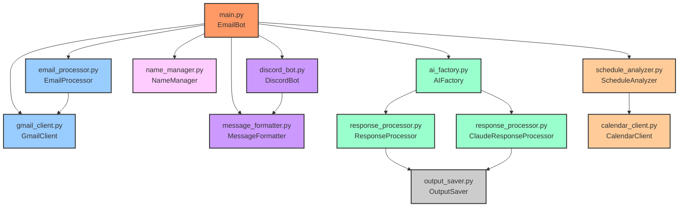
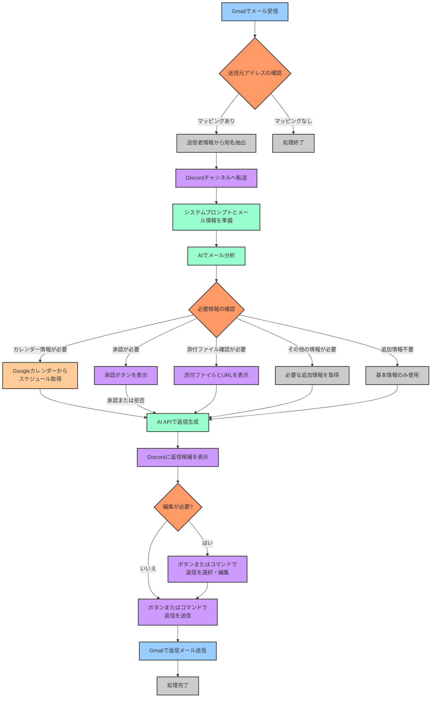

# Gmail-Discord自動転送・返信システム 開発者ドキュメント


## 📋 概要

このドキュメントは、Gmail-Discord自動転送・返信システムの開発者向け情報を提供します。システムの改良や拡張を行いたい開発者のために、詳細な技術情報、アーキテクチャ、モジュール構成などを説明します。

[ユーザー向けドキュメントに戻る](README.md)

## 📚 目次

1. [システム要件](#-システム要件)
2. [API設定ガイド](#-api設定ガイド)
3. [プロジェクト構造](#-プロジェクト構造)
4. [モジュール詳細](#-モジュール詳細)
5. [システムプロンプト](#-システムプロンプト)
6. [処理フロー詳細](#-処理フロー詳細)
7. [API料金プラン](#-api料金プラン)
8. [拡張ガイド](#-拡張ガイド)
9. [トラブルシューティング](#-トラブルシューティング)
10. [ライセンス](#-ライセンス)

## 💻 システム要件

<details>
<summary>クリックして展開</summary>

このシステムを実行するために必要な環境要件です。

- Python 3.8以上
- pip（Pythonパッケージマネージャー）
- インターネット接続
- Gmail、Discord、OpenAI/Anthropic、Googleカレンダーの各アカウント

### 必要なPythonパッケージ

```
discord.py>=2.0.0
google-api-python-client>=2.0.0
google-auth-httplib2>=0.1.0
google-auth-oauthlib>=0.5.0
openai>=0.27.0
anthropic>=0.3.0
python-dotenv>=0.19.0
pytz>=2021.1
async-timeout>=4.0.0
```

</details>

## 🔑 API設定ガイド

<details>
<summary>Gmail API設定</summary>

Gmail APIを設定して、メールの読み取りと送信を可能にします。

1. [Google Cloud Console](https://console.cloud.google.com/)にアクセスし、新しいプロジェクトを作成
2. 左側のメニューから「APIとサービス」→「ライブラリ」を選択
3. 検索バーで「Gmail API」を検索し、選択して「有効にする」をクリック
4. 「認証情報を作成」をクリックし、「OAuth クライアント ID」を選択
5. 「同意画面を構成」をクリックし、必要な情報を入力
   - ユーザータイプ: 外部
   - アプリ名、ユーザーサポートメール、デベロッパーの連絡先情報を入力
   - スコープの追加画面で「.../auth/gmail.readonly」と「.../auth/gmail.send」を追加
   - テストユーザーにご自身のGmailアドレスを追加
   - スコープの追加方法：左上の３本線から APIとサービスから認証情報を開く｡設定したいOAuth 2.0 クライアント IDの部分から、データアクセスへ移動しスコープの追加を行う。
6. 「認証情報」ページに戻り、「認証情報を作成」→「OAuth クライアント ID」を選択
   - アプリケーションの種類: デスクトップアプリ
   - 名前を入力し、「作成」をクリック
7. ダウンロードボタンをクリックして認証情報（credentials.json）をダウンロード
8. ダウンロードしたファイルを`gmail_discord_bot/config/`ディレクトリに配置

9. **参考動画**: Gmail APIの設定方法については、以下の動画も参考にしてください：
   - [Gmail API設定解説動画](https://m.youtube.com/watch?v=TXvFaTn5lck&pp=ygUJZ21haWwgYXBp)

#### Gmail API認証の詳細手順

このプロジェクトでは、Gmail APIを使用するための認証を簡単に行うためのスクリプトを用意しています。以下の手順に従って設定を完了させてください。

1. **認証情報ファイルの配置**
   - ダウンロードしたJSONファイルの名前を「credentials.json」に変更します
   - このファイルを `gmail_discord_bot/config/` ディレクトリに配置します

2. **アクセストークンの取得**
   - 以下のコマンドを実行して、Gmail APIのアクセストークンを取得します：
   ```bash
   python gmail_discord_bot/get_gmail_token.py
   ```
   - ブラウザが開き、Googleアカウントへのログインと権限の承認を求められます
   - 承認すると、`token.json` ファイルが `gmail_discord_bot/config/` ディレクトリに生成されます

3. **Gmail APIのテスト**
   - 以下のコマンドを実行して、APIが正しく設定されているか確認します：
   ```bash
   python gmail_discord_bot/test_gmail_api.py
   ```
   - このスクリプトは、Gmailのラベル一覧と最近のメール（最大5件）を表示します
   - 正常に動作すれば、Gmail APIの設定は完了です

4. **注意事項**
   - OAuth同意画面で「外部」を選択した場合、アプリは「テスト」モードになります
   - テストモードでは、明示的に追加したテストユーザーのみがアプリを使用できます
   - 個人的な使用やテスト目的であれば、「テスト」モードでも問題ありません
   - 実際の運用環境では、アプリを「本番」モードに移行する必要がありますが、そのためにはGoogleの審査が必要です

</details>

<details>
<summary>Discord API設定</summary>

Discordボットを作成し、メッセージの送受信を可能にします。

1. [Discord Developer Portal](https://discord.com/developers/applications)にアクセス
2. 「New Application」をクリックし、アプリケーション名を入力して作成
3. 左側のメニューから「Bot」を選択し、「Add Bot」をクリック
4. 「Reset Token」をクリックしてトークンを表示し、コピー（このトークンは後で`.env`ファイルに設定）
5. 「MESSAGE CONTENT INTENT」を有効化
6. 左側のメニューから「OAuth2」→「URL Generator」を選択
7. 「SCOPES」で「bot」を選択
8. 「BOT PERMISSIONS」で以下の権限を選択:
   - Read Messages/View Channels
   - Send Messages
   - Embed Links
   - Attach Files
   - Read Message History
   - Add Reactions
9. 生成されたURLをコピーしてブラウザで開き、ボットを追加したいDiscordサーバーを選択
10. サーバーのIDをコピー（後で`.env`ファイルに設定）
    - サーバーIDを取得するには、Discordの設定で開発者モードを有効にし、サーバー名を右クリックして「IDをコピー」を選択

</details>

<details>
<summary>OpenAI API設定</summary>

ChatGPTを使用するためのAPIキーを取得します。

1. [OpenAIのウェブサイト](https://platform.openai.com/)にアクセスし、アカウントを作成またはログイン
2. 右上のプロファイルアイコンをクリックし、「View API keys」を選択
3. 「Create new secret key」をクリックし、新しいAPIキーを生成
4. 生成されたAPIキーをコピー（このキーは後で`.env`ファイルに設定）

</details>

<details>
<summary>Claude API設定</summary>

Claude AIを使用するためのAPIキーを取得します。

1. [Anthropicのウェブサイト](https://console.anthropic.com/)にアクセスし、アカウントを作成またはログイン
2. 「API Keys」セクションに移動
3. 「Create API Key」をクリックし、新しいAPIキーを生成
4. 生成されたAPIキーをコピー（このキーは後で`.env`ファイルに設定）

</details>

<details>
<summary>Googleカレンダー API設定</summary>

Googleカレンダーと連携して、スケジュール情報を取得します。

1. [Google Cloud Console](https://console.cloud.google.com/)で、Gmail APIを設定したのと同じプロジェクトを使用
2. 左側のメニューから「APIとサービス」→「ライブラリ」を選択
3. 検索バーで「Google Calendar API」を検索し、選択して「有効にする」をクリック
4. 「認証情報を作成」をクリックし、「OAuth クライアント ID」を選択
5. アプリケーションの種類: デスクトップアプリ
6. 名前を入力し、「作成」をクリック
7. スコープの追加方法：左上の３本線から APIとサービスから認証情報を開く｡設定したいOAuth 2.0 クライアント IDの部分から、データアクセスへ移動しスコープの追加を行う。
8. ダウンロードボタンをクリックして認証情報（calendar_credentials.json）をダウンロード
9. ダウンロードしたファイルを`gmail_discord_bot/config/`ディレクトリに配置

</details>

## 📁 プロジェクト構造

<details>
<summary>クリックして展開</summary>

このセクションでは、プロジェクトのディレクトリ構造と各ファイルの役割を詳細に説明します。

```
gmail_discord_bot/
├── __init__.py
├── main.py                      # アプリケーションのエントリーポイント
├── get_gmail_token.py           # Gmail APIトークン取得スクリプト
├── test_gmail_api.py            # Gmail API動作確認スクリプト
├── gmail_module/                # Gmailとの連携を担当
│   ├── __init__.py
│   ├── gmail_client.py          # Gmail APIクライアント
│   └── email_processor.py       # メール処理ロジック
├── discord_module/              # Discordとの連携を担当
│   ├── __init__.py
│   ├── discord_bot.py           # Discordボットの実装
│   └── message_formatter.py     # メッセージフォーマット処理
├── name_module/                 # 宛名管理を担当
│   ├── __init__.py
│   ├── name_extractor.py        # メールから宛名情報を抽出
│   └── name_manager.py          # 宛名情報の管理
├── chatgpt_module/              # ChatGPT連携を担当
│   ├── __init__.py
│   └── response_processor.py    # 応答処理
├── claude_module/               # Claude連携を担当
│   ├── __init__.py
│   └── response_processor.py    # 応答処理
├── ai_module/                   # AI共通モジュール
│   ├── __init__.py
│   └── ai_factory.py            # AIプロバイダーファクトリー
├── calendar_module/             # Googleカレンダー連携を担当
│   ├── __init__.py
│   ├── calendar_client.py       # カレンダーAPIクライアント
│   └── schedule_analyzer.py     # スケジュール分析
├── utils/                       # ユーティリティ関数
│   ├── __init__.py
│   ├── logger.py                # ロギング
│   └── output_saver.py          # AI出力保存
├── config/                      # 設定関連
│   ├── config.py                # 設定管理
│   ├── .env.example             # 環境変数サンプル
│   ├── .env                     # 環境変数（作成必要）
│   ├── 01_email_analyzer_prompt.txt # メール分析用システムプロンプト
│   ├── 02_email_responder_prompt.txt # 返信生成用システムプロンプト
│   ├── email_settings.json      # メール設定
│   └── data/                    # JSONデータファイル保存ディレクトリ
│       └── name_database.json   # 名前データベース
├── logs/                        # ログファイル保存ディレクトリ
```

</details>

## 🧩 モジュール詳細

<details>
<summary>モジュール間の関係図</summary>



</details>

<details>
<summary>main.py</summary>

システム全体の起動と制御を担当します。各モジュールを初期化し、メールポーリングとDiscordボットのイベントループを開始します。

**主要クラス**: `EmailBot`

**主要メソッド**:
- `__init__`: 各モジュールを初期化
- `process_email_for_discord`: メールを処理してDiscordに送信
- `check_emails`: 新しいメールをチェックして処理
- `periodic_check`: 定期的にメールをチェック
- `run`: ボットを実行

**処理フロー**:
1. 各モジュールのインスタンスを作成
2. 定期的にGmailから新しいメールをチェック
3. 新しいメールを処理してDiscordに転送
4. AIでメール分析と返信生成
5. 返信候補をDiscordに表示
6. ユーザーの選択に基づいてメールを送信

</details>

<details>
<summary>gmail_module</summary>

Gmailからのメール取得と送信を担当します。

**gmail_client.py**:
- Gmail APIとの通信を行い、メールの取得と送信を実装
- OAuth2認証の処理
- メールの解析と構造化データへの変換
- 添付ファイルの処理

**主要メソッド**:
- `initialize_service`: Gmail APIサービスの初期化
- `get_unread_emails`: 未読メールを取得
- `mark_as_read`: メールを既読にする
- `get_attachments`: メールの添付ファイルを取得
- `send_email`: メールを送信する

**email_processor.py**:
- メールの解析、フィルタリング、処理を担当
- メールヘッダーの解析
- メールアドレスとDiscordチャンネルのマッピング

</details>

<details>
<summary>discord_module</summary>

Discordボットの操作とメッセージ処理を担当します。

**discord_bot.py**:
- Discordボットの実装
- コマンド処理
- ボタンやモーダルなどのUIコンポーネント
- メッセージの送受信

**主要クラス**:
- `DiscordBot`: メインのボットクラス
- `ApprovalView`: 承認ボタンを含むUI
- `SendConfirmView`: 送信確認ボタンを含むUI
- `EditResponseModal`: 返信編集用モーダル

**主要メソッド**:
- `send_email_notification`: メール通知をDiscordに送信
- `send_response_options`: 返信候補をDiscordに送信
- `send_approval_request`: 承認リクエストを送信
- `send_attachments_and_urls`: 添付ファイルとURLを送信

**message_formatter.py**:
- Discordメッセージのフォーマット
- 埋め込み、ボタンの作成
- メッセージの装飾

</details>

<details>
<summary>ai_module</summary>

AIプロバイダー（ChatGPTとClaude）の切り替えを担当します。

**ai_factory.py**:
- ファクトリーパターンを使用して、設定に基づいて適切なAIプロバイダーのインスタンスを生成
- 環境変数から指定されたAIプロバイダーを選択

**主要メソッド**:
- `create_response_processor`: 応答処理クラスを作成

</details>

<details>
<summary>chatgpt_module / claude_module</summary>

各AIプロバイダーとの連携を担当します。

**response_processor.py**:
- AIからの応答を処理し、XML形式の出力を解析
- メール分析と返信生成のAPIリクエスト
- 結果の構造化と保存

**主要メソッド**:
- `analyze_email`: メールを分析してタイプを判定
- `generate_responses`: 返信候補を生成
- `_extract_analysis`: 分析結果を抽出
- `_extract_required_info`: 必要情報を抽出
- `_split_responses`: 返信を抽出

</details>

<details>
<summary>calendar_module</summary>

Googleカレンダーとの連携を担当します。

**calendar_client.py**:
- Googleカレンダー APIとの通信
- 予定の取得
- 空き状況の確認

**主要メソッド**:
- `initialize_service`: カレンダーAPIサービスの初期化
- `get_events`: 指定期間のイベントを取得
- `get_free_busy`: 指定期間の空き状況を取得

**schedule_analyzer.py**:
- 取得した予定を分析
- 利用可能なスロットを特定
- 日程候補とのマッチング

**主要メソッド**:
- `get_available_slots`: 利用可能な時間枠を取得
- `analyze_date_suggestions`: 日程候補を分析して最適な日程を提案
- `_parse_date_suggestion`: 日程候補を構造化データに変換
- `_calculate_match_score`: 日程候補と利用可能なスロットのマッチングスコアを計算

</details>

<details>
<summary>name_module</summary>

送信者情報からの宛名抽出と管理を担当します。

**name_manager.py**:
- 宛名情報の保存、取得、更新
- メールアドレスからの宛名抽出
- 会社名と担当者名の管理

**主要メソッド**:
- `process_email`: メールから送信者情報を抽出
- `format_address`: 宛名を「〇〇会社 〇〇様」の形式でフォーマット
- `get_sender_info`: 送信者情報を取得
- `save_sender_info`: 送信者情報を保存

</details>

<details>
<summary>utils</summary>

ロギングやAI出力の保存などのユーティリティ機能を担当します。

**logger.py**:
- ログ機能の提供
- フロー追跡用のデコレータ
- ログレベルの管理

**output_saver.py**:
- AI出力を保存
- 分析結果と返信候補の保存
- JSONファイル形式での保存

</details>

<details>
<summary>config</summary>

設定ファイルとプロンプトの管理を担当します。

**config.py**:
- 環境変数の読み込み
- 設定ファイルの管理
- システムプロンプトの読み込み

**主要メソッド**:
- `get_email_analyzer_prompt`: メール分析用プロンプトを取得
- `get_email_responder_prompt`: 返信生成用プロンプトを取得
- `get_email_settings`: メール設定を取得

</details>

## 📝 システムプロンプト

<details>
<summary>システムプロンプトの概要</summary>

システムプロンプトは2つの別々のファイルに分かれています：

1. **01_email_analyzer_prompt.txt** - メール分析用のシステムプロンプト
   - メールの内容を分析し、必要な情報のタイプを特定するためのプロンプト
   - 分析結果は `<分析>...</分析>` 形式で出力
   - 必要情報は `<必要情報><タイプ>...</タイプ></必要情報>` 形式で出力

2. **02_email_responder_prompt.txt** - 返信生成用のシステムプロンプト
   - 分析結果と追加情報を基に適切な返信を生成するためのプロンプト
   - 返信内容は `<返信>...</返信>` 形式で出力

これらのファイルは `gmail_discord_bot/config/` ディレクトリに配置されています。必要に応じて内容をカスタマイズすることができます。

</details>

<details>
<summary>メール分析プロンプトの詳細</summary>

メール分析プロンプト（01_email_analyzer_prompt.txt）は、AIにメールの内容を分析させ、適切な処理方法を判断させるためのものです。

**主要な機能**:
- メールの主題、送信者の意図、必要なアクションを特定
- 文体やニュアンスの分析
- 必要な追加情報のタイプを判断

**情報タイプ**:
1. **カレンダー**: 日程調整が必要な場合
   - 日程候補を `<日程候補><候補>...</候補></日程候補>` 形式で抽出
   - 時間範囲を「開始時間-終了時間」の形式で指定

2. **承認**: 何らかの許可や承認が必要な場合
   - 承認が必要な内容と理由を詳細に記載

3. **確認**: 添付データなどの確認が必要な場合
   - 確認が必要なデータの内容を記載

4. **その他**: 上記に当てはまらない情報が必要な場合
   - 必要な情報の内容と理由を記載

**出力例**:
```
<分析>
このメールは取引先からの会議日程調整の依頼です。先方は来週の火曜日か水曜日での打ち合わせを希望しています。
</分析>
<必要情報>
<タイプ>カレンダー</タイプ>
<詳細>来週の火曜日と水曜日の空き状況を確認し、打ち合わせ可能な時間帯を提案する必要があります。</詳細>
</必要情報>
<日程候補>
<候補>5月10日14:00-15:00</候補>
<候補>5月11日15:00-16:00</候補>
</日程候補>
```

</details>

<details>
<summary>返信生成プロンプトの詳細</summary>

返信生成プロンプト（02_email_responder_prompt.txt）は、メール分析結果と追加情報に基づいて適切な返信を生成するためのものです。

**主要な機能**:
- 自然なビジネスメール形式の返信を作成
- 日本語のビジネスメールとして適切な敬語と構成を使用
- 情報タイプに応じた対応を行う

**情報タイプ別の対応**:
1. **カレンダー情報**:
   - 提供された日程提案情報を使用
   - 選択された日程を確定した日程として返信に含める
   - 代替日程候補を選択肢として提案

2. **承認情報**:
   - 承認結果（approve/reject）に基づいて適切な返信を作成
   - ビジネスコンテキストに沿った自然な表現を使用

3. **確認情報**:
   - 添付ファイルやURLの内容について言及
   - 確認後に返信することを伝える

4. **その他の情報**:
   - 必要な情報を明確に説明
   - 情報入手後に返信することを伝える

**署名情報**:
- 設定ファイルから読み込まれた署名情報を含める
- 「───────────────────」で区切られた形式で追加

**出力例**:
```
<分析>
1. メールは日程調整の依頼に対する返信
2. カレンダー情報から5月10日14:00-15:00が空いていることを確認
3. 丁寧な言葉遣いで承諾の意を示す
4. 場所と準備物についても言及する
</分析>
<返信>
株式会社〇〇 〇〇様

お世話になっております。
ご連絡いただきありがとうございます。

ご希望いただいた日程について、5月10日14:00-15:00でお打ち合わせが可能です。
弊社会議室をご用意いたしますので、当日は正面玄関にお越しください。

資料につきましては、こちらで準備いたします。
何かご不明な点がございましたら、お気軽にお知らせください。

どうぞよろしくお願いいたします。

───────────────────
株式会社サンプル
山田太郎
Email：yamada@sample.com
URL: https://www.sample.com
───────────────────
</返信>
```

</details>

## 🔄 処理フロー詳細

<details>
<summary>処理フローの図解</summary>



</details>

<details>
<summary>処理フローの詳細説明</summary>

### 1. メール受信と初期処理
- **Gmailでメール受信**: GmailClientが定期的に新しいメールをチェック
- **送信元アドレスの確認**: email_channel_mapping.jsonに基づいて、対応するDiscordチャンネルを特定
- **送信者情報から宛名抽出**: NameManagerが送信者情報から宛名（会社名・担当者名）を抽出

### 2. Discord転送
- **Discordチャンネルへ転送**: DiscordBotがメール内容をフォーマットしてDiscordに送信
- **システムプロンプトとメール情報を準備**: メール分析用のプロンプトを準備

### 3. メール分析
- **AIでメール分析**: AIFactoryで選択されたAIプロバイダーがメールを分析
- **必要情報の確認**: 分析結果から必要な追加情報のタイプを判断

### 4. 追加情報の取得
- **カレンダー情報が必要な場合**: ScheduleAnalyzerがGoogleカレンダーから予定を取得し、利用可能なスロットを特定
- **承認が必要な場合**: DiscordBotが承認ボタンを表示し、ユーザーの承認を待機
- **添付ファイル確認が必要な場合**: GmailClientが添付ファイルを取得し、DiscordBotが表示
- **その他の情報が必要な場合**: DiscordBotが対処法を提案し、ユーザーの入力を待機

### 5. 返信生成と送信
- **AI APIで返信生成**: 分析結果と追加情報を基に、AIが返信候補を生成
- **Discordに返信候補を表示**: DiscordBotが返信候補をフォーマットして表示
- **返信の選択・編集**: ユーザーがボタンまたはコマンドで返信を選択・編集
- **返信の送信**: ユーザーが送信を確認すると、GmailClientがメールを送信

### 6. 処理完了
- **処理完了**: 送信結果をDiscordに通知し、処理を完了

</details>

## 💰 API料金プラン

<details>
<summary>クリックして展開</summary>

このセクションでは、システムで使用する各APIの料金プランについて説明します。無料枠と有料プランの情報を把握し、コスト管理の参考にしてください。

| API名 | 無料プラン | 無料枠の制限 | 有料プラン | 料金体系 | 備考 |
|-------|------------|--------------|------------|----------|------|
| **Gmail API** | あり | 1日あたり約1,000,000リクエスト | Google Workspaceの一部として提供 | Google Workspaceの料金プランに依存 | 個人利用の場合は通常無料枠で十分 |
| **Discord API** | あり | ボット作成と基本機能は無料 | なし | なし | サーバーブーストなどの別機能に課金要素あり |
| **OpenAI API (ChatGPT)** | なし | なし | 従量課金制 | モデルとトークン数に基づく従量課金<br>例：GPT-4は入力$0.01/1Kトークン、<br>出力$0.03/1Kトークン | 費用がかかる可能性のあるAPI |
| **Anthropic API (Claude)** | なし | なし | 従量課金制 | モデルとトークン数に基づく従量課金<br>例：Claude 3.5 Sonnetは入力$3/1Mトークン、<br>出力$15/1Mトークン | 費用がかかる可能性のあるAPI |
| **Google Calendar API** | あり | 1日あたり約1,000,000リクエスト | Google Workspaceの一部として提供 | Google Workspaceの料金プランに依存 | 個人利用の場合は通常無料枠で十分 |

**注意事項**:
- OpenAIとAnthropic APIは無料枠がないため、使用量に応じた費用が発生します
- 料金プランは変更される可能性があるため、各サービスの公式サイトで最新情報を確認してください
- 使用量が多い場合は、レート制限やコスト管理の仕組みを実装することをお勧めします

</details>

## 🔧 拡張ガイド

<details>
<summary>新しいAIプロバイダーの追加</summary>

新しいAIプロバイダーを追加するには、以下の手順に従ってください：

1. **モジュールディレクトリの作成**
   ```
   gmail_discord_bot/new_ai_module/
   ├── __init__.py
   └── response_processor.py
   ```

2. **response_processor.pyの実装**
   ```python
   # gmail_discord_bot/new_ai_module/response_processor.py
   import re
   from ..config import config
   from ..utils.logger import setup_logger
   from ..calendar_module.schedule_analyzer import ScheduleAnalyzer
   from ..utils.output_saver import OutputSaver

   logger = setup_logger(__name__)

   class NewAIResponseProcessor:
       def __init__(self):
           # APIキーの設定
           self.api_key = config.NEW_AI_API_KEY
           self.schedule_analyzer = ScheduleAnalyzer()
           self.output_saver = OutputSaver()
           self.settings = config.get_email_settings()
       
       async def analyze_email(self, prompt, email_id=None):
           """メールを分析"""
           # 新しいAI APIを使用した実装
           # ...
           
           # 分析結果を構造化
           analysis_result = {
               "analysis": analysis,
               "required_info": required_info
           }
           
           return analysis_result
       
       async def generate_responses(self, prompt, analysis_result=None, num_responses=1, email_id=None, additional_info=None):
           """返信を生成"""
           # 新しいAI APIを使用した実装
           # ...
           
           return responses
       
       # 以下、必要なヘルパーメソッドを実装
       def _extract_analysis(self, text):
           # ...
       
       def _extract_required_info(self, text):
           # ...
       
       def _split_responses(self, response_text):
           # ...
   ```

3. **ai_factory.pyの更新**
   ```python
   # gmail_discord_bot/ai_module/ai_factory.py
   from ..chatgpt_module.response_processor import ResponseProcessor as ChatGPTResponseProcessor
   from ..claude_module.response_processor import ClaudeResponseProcessor
   from ..new_ai_module.response_processor import NewAIResponseProcessor
   from ..config import config
   from ..utils.logger import setup_logger

   logger = setup_logger(__name__)

   class AIFactory:
       """AIプロバイダーを選択するためのファクトリークラス"""
       
       @staticmethod
       def create_response_processor(provider=None):
           """応答処理クラスを作成"""
           if provider is None:
               provider = config.DEFAULT_AI_PROVIDER
           
           logger.info(f"AIプロバイダー '{provider}' の応答処理クラスを作成")
           
           if provider.lower() == "chatgpt":
               return ChatGPTResponseProcessor()
           elif provider.lower() == "claude":
               return ClaudeResponseProcessor()
           elif provider.lower() == "newai":  # 新しいAIプロバイダー
               return NewAIResponseProcessor()
           else:
               logger.warning(f"未知のAIプロバイダー '{provider}' が指定されました。デフォルトのChatGPTを使用します。")
               return ChatGPTResponseProcessor()
   ```

4. **環境変数の追加**
   ```
   # .env
   NEW_AI_API_KEY=your_new_ai_api_key
   ```

5. **config.pyの更新**
   ```python
   # gmail_discord_bot/config/config.py
   # 環境変数の読み込み部分に追加
   NEW_AI_API_KEY = os.getenv('NEW_AI_API_KEY')
   ```

</details>

<details>
<summary>カスタムプロンプトの作成</summary>

システムプロンプトをカスタマイズするには、以下のファイルを編集します：

1. **メール分析用プロンプト**
   - ファイル: `gmail_discord_bot/config/01_email_analyzer_prompt.txt`
   - 編集ポイント:
     - 分析の詳細度を調整
     - 必要情報のタイプを追加または変更
     - 出力形式のカスタマイズ

   **例**:
   ```
   あなたは優秀なメール分析アシスタントです。ユーザーに来たメールを分析し、適切な処理方法を判断することが目的です。以下のプロセスに従ってください：

   1. **メール分析**
      - 受信メールの内容を分析し、その分析結果を記述してください
      - 主題、送信者の意図、必要なアクション、重要な詳細を特定してください
      - 文体やニュアンス、緊急度についても分析する

   2. **分析結果出力形式**
      - 以下のXML形式で分析結果を出力してください：

      <本文>
         [メールの本文のみをここに記述]
      </本文>
      <分析>
         [メールの分析結果をここに記述]
      </分析>
      <緊急度>
         [高/中/低]
      </緊急度>

   3. **追加情報要求**
      - 返信に必要な追加情報がある場合は、以下のタグ形式で指定してください：

      <必要情報>
         <タイプ>[情報タイプ]</タイプ>
         <詳細>[必要な情報の詳細説明]</詳細>
      </必要情報>

      利用可能な情報タイプ:
      - カレンダー（予定確認や日程調整が必要な場合）
      - 承認（何らかの許可や承認が必要な場合）
      - 確認（添付データなどの確認が必要な場合）
      - 予算（予算に関する情報が必要な場合）
      - その他（上記に当てはまらない情報が必要な場合）
   ```

2. **返信生成用プロンプト**
   - ファイル: `gmail_discord_bot/config/02_email_responder_prompt.txt`
   - 編集ポイント:
     - 返信のスタイルや敬語レベルを調整
     - 情報タイプに応じた対応を変更
     - 署名形式のカスタマイズ

   **例**:
   ```
   あなたは優秀なメール返信アシスタントです。ユーザーに来たメールに対する適切な返信を作成することが目的です。
   まず最初に情報タイプとその内容をもとに、返信する内容をステップバイステップで考えた上で、以下のプロセスに従ってください：

   1. **返信作成**
      - 提供されたメール分析結果と追加情報に基づいて返信内容を考案してください
      - 自然なビジネスメール形式の返信を作成してください
      - 日本語のビジネスメールとして適切な敬語と構成を使用してください
      - メールの内容が砕けた内容の場合はある程度自然な返信となるように調整して下さい
      - 簡潔かつ明確な文章を心がけてください
      - 緊急度が高い場合は、迅速な対応を示す表現を使用してください

   2. **返信出力形式**
      - 以下のXML形式で返信内容を出力してください
      - 会社名、相手の名前、以外の本文と署名のみの出力とする：

      <分析>
         [返信する内容をステップバイステップで分析]
      </分析>
      <返信>
         [メール本文をここに記述]
      </返信>
   ```

3. **プロンプト編集時の注意点**:
   - XML形式の出力構造を維持する
   - 必要なタグ（`<分析>`, `<返信>`, `<必要情報>` など）を保持する
   - 新しいタグを追加する場合は、対応するコードも修正する必要がある

</details>

<details>
<summary>新機能の追加</summary>

新機能を追加する場合は、以下の点に注意してください：

1. **モジュール構造に従った実装**
   - 機能の性質に応じて適切なモジュールに実装
   - 新しいモジュールが必要な場合は、既存の構造に合わせて作成

2. **インターフェースの互換性維持**
   - 既存のメソッドシグネチャを変更する場合は、すべての呼び出し元を更新
   - 新しいメソッドを追加する場合は、適切なデフォルト値を設定

3. **エラーハンドリングとロギング**
   - 適切な例外処理を実装
   - ロギングを追加して、デバッグを容易にする

4. **設定の柔軟性**
   - ハードコードされた値は避け、設定ファイルから読み込む
   - 環境変数を使用して、デプロイ環境に応じた設定を可能にする

5. **テストの作成**
   - 新機能のユニットテストを作成
   - エッジケースも考慮したテストを実装

### 例: 翻訳機能の追加

1. **新しいモジュールの作成**
   ```
   gmail_discord_bot/translation_module/
   ├── __init__.py
   └── translator.py
   ```

2. **translator.pyの実装**
   ```python
   # gmail_discord_bot/translation_module/translator.py
   import requests
   from ..config import config
   from ..utils.logger import setup_logger

   logger = setup_logger(__name__)

   class Translator:
       def __init__(self):
           self.api_key = config.TRANSLATION_API_KEY
           self.base_url = "https://api.example-translation.com/v1/translate"
       
       def translate(self, text, source_lang="auto", target_lang="ja"):
           """テキストを翻訳"""
           try:
               response = requests.post(
                   self.base_url,
                   headers={"Authorization": f"Bearer {self.api_key}"},
                   json={
                       "text": text,
                       "source": source_lang,
                       "target": target_lang
                   }
               )
               
               response.raise_for_status()
               result = response.json()
               
               logger.info(f"翻訳完了: {source_lang} -> {target_lang}")
               return result["translated_text"]
           
           except Exception as e:
               logger.error(f"翻訳エラー: {e}")
               return text  # エラー時は元のテキストを返す
       
       def detect_language(self, text):
           """テキストの言語を検出"""
           try:
               response = requests.post(
                   f"{self.base_url}/detect",
                   headers={"Authorization": f"Bearer {self.api_key}"},
                   json={"text": text}
               )
               
               response.raise_for_status()
               result = response.json()
               
               logger.info(f"言語検出完了: {result['language']}")
               return result["language"]
           
           except Exception as e:
               logger.error(f"言語検出エラー: {e}")
               return "unknown"
   ```

3. **main.pyの更新**
   ```python
   # gmail_discord_bot/main.py
   # EmailBotクラスに翻訳機能を追加
   
   from .translation_module.translator import Translator
   
   class EmailBot:
       def __init__(self, ai_provider=None):
           # 既存の初期化コード
           # ...
           
           # 翻訳モジュールの初期化
           self.translator = Translator()
       
       async def process_email_for_discord(self, email_data):
           # 既存のコード
           # ...
           
           # 言語検出と必要に応じた翻訳
           detected_lang = self.translator.detect_language(email_data['body'])
           
           if detected_lang != "ja" and detected_lang != "unknown":
               # 本文を翻訳
               translated_body = self.translator.translate(email_data['body'], source_lang=detected_lang, target_lang="ja")
               
               # 翻訳結果を保存
               email_data['original_body'] = email_data['body']
               email_data['body'] = translated_body
               email_data['translated'] = True
               email_data['source_lang'] = detected_lang
               
               logger.info(f"メール本文を翻訳しました: {detected_lang} -> ja")
           
           # 残りの処理を続行
           # ...
   ```

4. **環境変数の追加**
   ```
   # .env
   TRANSLATION_API_KEY=your_translation_api_key
   ```

5. **config.pyの更新**
   ```python
   # gmail_discord_bot/config/config.py
   # 環境変数の読み込み部分に追加
   TRANSLATION_API_KEY = os.getenv('TRANSLATION_API_KEY')
   ```

</details>

## 🔍 トラブルシューティング

<details>
<summary>API認証エラー</summary>

### 問題: API認証に関するエラーが発生する

**エラーメッセージ例**:
```
Error: invalid_grant: Token has been expired or revoked.
```

**解決策**:
1. **認証情報ファイルの確認**
   - `credentials.json`と`calendar_credentials.json`が正しい場所にあるか確認
   - ファイルの内容が正しいか確認（JSONフォーマットが壊れていないか）

2. **トークンの再生成**
   - `token.json`と`calendar_token.json`を削除
   - アプリケーションを再起動して再認証を行う
   ```bash
   rm gmail_discord_bot/config/token.json
   rm gmail_discord_bot/config/calendar_token.json
   python -m gmail_discord_bot.main
   ```

3. **APIキーの確認**
   - `.env`ファイルのAPIキーが正しく設定されているか確認
   - APIキーが有効期限切れでないか確認

4. **APIの有効化確認**
   - Google Cloud Consoleで必要なAPIが有効になっているか確認
   - [Google Cloud Console](https://console.cloud.google.com/)にアクセス
   - 「APIとサービス」→「ライブラリ」で各APIのステータスを確認

5. **スコープの確認**
   - 必要なスコープが正しく設定されているか確認
   - Gmail APIの場合: `https://www.googleapis.com/auth/gmail.readonly`と`https://www.googleapis.com/auth/gmail.send`
   - Googleカレンダー APIの場合: `https://www.googleapis.com/auth/calendar.readonly`

</details>

<details>
<summary>メールが転送されない</summary>

### 問題: 新しいメールが受信されてもDiscordに転送されない

**エラーメッセージ例**:
```
No matching channel found for email from: example@domain.com
```

**解決策**:
1. **マッピング設定の確認**
   - `email_channel_mapping.json`ファイルの内容を確認
   - メールアドレスとDiscordチャンネルIDのマッピングが正しいか確認
   ```json
   {
     "example@domain.com": {
       "email": "example@domain.com",
       "name": "山田太郎",
       "company": "Example株式会社",
       "discord_channel_id": "1234567890123456789"
     }
   }
   ```

2. **ログの確認**
   - `gmail_discord_bot/logs/`ディレクトリのログファイルを確認
   - エラーメッセージを特定して対処

3. **Gmail APIの設定確認**
   - スコープが正しく設定されているか確認
   - `GMAIL_SCOPES`環境変数に`https://www.googleapis.com/auth/gmail.readonly`が含まれているか確認

4. **Discordボットの設定確認**
   - ボットがサーバーに正しく招待されているか確認
   - ボットが指定されたチャンネルにアクセスできるか確認
   - チャンネルIDが正しいか確認（開発者モードを有効にして右クリックで「IDをコピー」）

5. **メールポーリングの確認**
   - `main.py`の`check_interval`が適切な値に設定されているか確認
   - デフォルトは60秒ごとにチェック

6. **手動でのメールチェック**
   - 以下のコードを実行して、メールが取得できるか確認
   ```python
   from gmail_discord_bot.gmail_module.gmail_client import GmailClient
   
   client = GmailClient()
   emails = client.get_unread_emails(max_results=5)
   for email in emails:
       print(f"ID: {email['id']}, Subject: {email['subject']}, From: {email['sender']}")
   ```

</details>

<details>
<summary>返信が生成されない</summary>

### 問題: メールは転送されるが、返信が生成されない

**エラーメッセージ例**:
```
Error: API request failed: 401 - Unauthorized
```

**解決策**:
1. **APIキーの確認**
   - OpenAIまたはClaude APIキーが正しく設定されているか確認
   - `.env`ファイルの`OPENAI_API_KEY`または`CLAUDE_API_KEY`を確認

2. **API使用制限の確認**
   - APIの使用制限に達していないか確認
   - OpenAIダッシュボードまたはAnthropic管理画面で使用状況を確認

3. **ログの確認**
   - `gmail_discord_bot/logs/`ディレクトリのログファイルを確認
   - エラーメッセージを特定して対処

4. **インターネット接続の確認**
   - インターネット接続が正常か確認
   - プロキシ設定が必要な環境の場合は、適切に設定されているか確認

5. **AIプロバイダーの設定確認**
   - `.env`ファイルの`DEFAULT_AI_PROVIDER`が正しく設定されているか確認
   - 有効な値は`chatgpt`または`claude`

6. **システムプロンプトの確認**
   - `01_email_analyzer_prompt.txt`と`02_email_responder_prompt.txt`の内容が正しいか確認
   - XML形式が正しく維持されているか確認

7. **手動でのAI API呼び出し**
   - 以下のコードを実行して、API呼び出しが成功するか確認
   ```python
   import openai
   from gmail_discord_bot.config import config
   
   openai.api_key = config.OPENAI_API_KEY
   response = openai.ChatCompletion.create(
       model=config.OPENAI_MODEL,
       messages=[
           {"role": "system", "content": "You are a helpful assistant."},
           {"role": "user", "content": "Hello, world!"}
       ]
   )
   print(response.choices[0].message.content)
   ```

</details>

<details>
<summary>Discordボットが応答しない</summary>

### 問題: Discordボットがコマンドに応答しない

**解決策**:
1. **ボットの起動確認**
   - ログで「〇〇としてログインしました」メッセージを確認
   - ボットのステータスがオンラインになっているか確認

2. **トークンの確認**
   - `.env`ファイルの`DISCORD_BOT_TOKEN`が正しいか確認
   - Discord Developer Portalでトークンが有効か確認

3. **権限の確認**
   - ボットに必要な権限が付与されているか確認
   - 「MESSAGE CONTENT INTENT」が有効になっているか確認

4. **サーバーIDの確認**
   - `.env`ファイルの`DISCORD_GUILD_ID`が正しいか確認
   - 開発者モードを有効にして、サーバー名を右クリックして「IDをコピー」

5. **コマンドプレフィックスの確認**
   - `discord_bot.py`の`command_prefix`が正しく設定されているか確認
   - デフォルトは`!`（例: `!help`）

6. **手動でのボット起動**
   - 以下のコードを実行して、ボットが起動するか確認
   ```python
   from gmail_discord_bot.discord_module.discord_bot import DiscordBot
   
   bot = DiscordBot()
   bot.run()
   ```

7. **Discordの接続状態確認**
   - Discordのサーバー接続が正常か確認
   - ファイアウォールやネットワーク設定でDiscordへの接続がブロックされていないか確認

</details>

<details>
<summary>カレンダー情報が取得できない</summary>

### 問題: カレンダー情報が正しく取得できない

**エラーメッセージ例**:
```
Error: The caller does not have permission
```

**解決策**:
1. **認証情報の確認**
   - `calendar_credentials.json`が正しい場所にあるか確認
   - `calendar_token.json`を削除して再認証を試みる

2. **スコープの確認**
   - `CALENDAR_SCOPES`環境変数に`https://www.googleapis.com/auth/calendar.readonly`が含まれているか確認
   - Google Cloud Consoleでスコープが正しく設定されているか確認

3. **カレンダー設定の確認**
   - `email_settings.json`のカレンダー設定が正しいか確認
   ```json
   {
     "calendar": {
       "days": 30,
       "working_hours": {
         "start": 18,
         "end": 23
       },
       "duration_minutes": 60,
       "skip_weekends": true
     }
   }
   ```

4. **タイムゾーンの確認**
   - `schedule_analyzer.py`のタイムゾーン設定が正しいか確認
   - デフォルトは`Asia/Tokyo`

5. **手動でのカレンダー情報取得**
   - 以下のコードを実行して、カレンダー情報が取得できるか確認
   ```python
   from gmail_discord_bot.calendar_module.calendar_client import CalendarClient
   
   client = CalendarClient()
   events = client.get_events(max_results=5)
   for event in events:
       print(f"Summary: {event.get('summary')}, Start: {event.get('start')}")
   ```

</details>

## 📄 ライセンス

<details>
<summary>クリックして展開</summary>

Apache License 2.0

このプロジェクトは[Apache License 2.0](LICENSE)の下で提供されています。

```
Copyright 2025 YUiCHI

Licensed under the Apache License, Version 2.0 (the "License");
you may not use this file except in compliance with the License.
You may obtain a copy of the License at

    http://www.apache.org/licenses/LICENSE-2.0

Unless required by applicable law or agreed to in writing, software
distributed under the License is distributed on an "AS IS" BASIS,
WITHOUT WARRANTIES OR CONDITIONS OF ANY KIND, either express or implied.
See the License for the specific language governing permissions and
limitations under the License.
```

</details>

**最終更新日**: 2025年4月6日