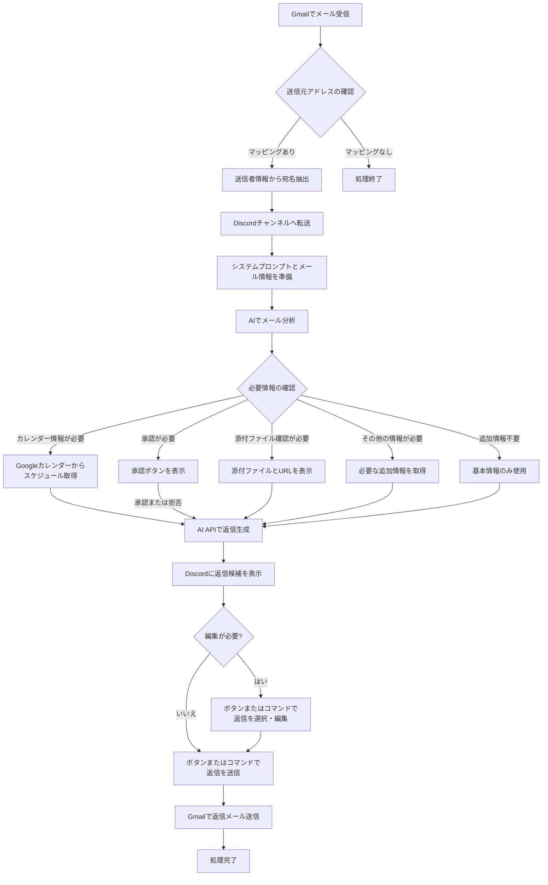

# Gmail-Discord自動転送・返信システム

[ざっくり説明書はこちら](https://claude.site/artifacts/a7cb17a6-755a-40e7-9856-a3190ded2948)

GmailからDiscordへのメール自動転送と、ChatGPTまたはClaude APIを活用した返信生成システム。送信元情報から適切な宛名（〇〇会社 〇〇様）を自動設定し、日程調整メールの場合はGoogleカレンダーと連携した候補日時の提案も行います。

## 目次

1. [機能概要](#機能概要)
2. [システム要件](#システム要件)
3. [インストール手順](#インストール手順)
4. [API料金プラン](#api料金プラン)
5. [API設定ガイド](#api設定ガイド)
   - [Gmail API設定](#gmail-api設定)
   - [Discord API設定](#discord-api設定)
   - [OpenAI API設定](#openai-api設定)
   - [Claude API設定](#claude-api設定)
   - [Googleカレンダー API設定](#googleカレンダー-api設定)
6. [設定ファイルの作成](#設定ファイルの作成)
   - [環境変数の設定](#環境変数の設定)
   - [メールとチャンネルのマッピング](#メールとチャンネルのマッピング)
7. [実行方法](#実行方法)
8. [使用方法](#使用方法)
   - [Discordコマンド一覧](#discordコマンド一覧)
   - [Discordボタン操作](#discordボタン操作)
   - [メール処理フロー](#メール処理フロー)
   - [処理フロー図](#処理フロー図)
9. [プロジェクト構造](#プロジェクト構造)
10. [トラブルシューティング](#トラブルシューティング)
11. [よくある質問（FAQ）](#よくある質問faq)
12. [ライセンス](#ライセンス)

## 機能概要
- **メール自動転送**: Gmailで受信したメールを送信元のメールアドレスごとに対応するDiscordチャンネルへ自動転送
- **宛名自動設定**: 送信元情報から会社名・担当者名を抽出し、「〇〇会社 〇〇様」の形式で自動設定
- **2段階AI処理**:
  1. メール分析: AIがメール内容を分析し、必要な追加情報のタイプを特定
  2. 返信生成: 分析結果と追加情報を基に最適な返信を生成
- **カレンダー連携**: 日程調整が必要と判断された場合、GoogleカレンダーAPIと連携して利用可能なスロットを取得し、適切な候補日時を含む返信を生成
- **XML形式出力**: AIの出力を構造化されたXML形式で処理し、分析結果と返信内容を明確に区別
- **日程調整機能**: 日程調整に関するメールの場合、GoogleカレンダーAPIと連携し、実際のスケジュール確認を行った上で適切な返信文（候補日時を含む）を自動生成
- **直感的なUI**: ボタンベースのインターフェースで返信の選択、編集、送信が可能
- **承認フロー**: 承認が必要なメールに対して承認/拒否の選択肢を提供し、結果に基づいた返信を生成
- **添付ファイル処理**: メールの添付ファイルとURLを抽出し、Discordで確認可能
- **出力保存機能**: AIの分析結果と生成された返信を保存し、後で参照可能

## システム要件

- Python 3.8以上
- pip（Pythonパッケージマネージャー）
- インターネット接続
- Gmail、Discord、OpenAI/Anthropic、Googleカレンダーの各アカウント

## インストール手順

1. リポジトリをクローンまたはダウンロード

```bash
git clone https://github.com/yourusername/gmail-discord-bot.git
cd gmail-discord-bot
```

2. 仮想環境の作成と有効化

```bash
# 仮想環境の作成
python -m venv venv

# 仮想環境の有効化
# Linuxの場合:
source venv/bin/activate
# Windowsの場合:
venv\Scripts\activate
```

3. 必要なパッケージのインストール

```bash
pip install -r requirements.txt
```

## API料金プラン

システムで使用する各APIの料金プランについて、無料枠と有料プランの情報をまとめています。

| API名 | 無料プラン | 無料枠の制限 | 有料プラン | 料金体系 | 備考 |
|-------|------------|--------------|------------|----------|------|
| **Gmail API** | あり | 1日あたり約1,000,000リクエスト | Google Workspaceの一部として提供 | Google Workspaceの料金プランに依存 | 個人利用の場合は通常無料枠で十分 |
| **Discord API** | あり | ボット作成と基本機能は無料 | なし | なし | サーバーブーストなどの別機能に課金要素あり |
| **OpenAI API (ChatGPT)** | なし | なし | 従量課金制 | モデルとトークン数に基づく従量課金<br>例：GPT-4は入力$0.01/1Kトークン、<br>出力$0.03/1Kトークン | 費用がかかる可能性のあるAPI |
| **Anthropic API (Claude)** | なし | なし | 従量課金制 | モデルとトークン数に基づく従量課金<br>例：Claude 3.5 Sonnetは入力$3/1Mトークン、<br>出力$15/1Mトークン | 費用がかかる可能性のあるAPI |
| **Google Calendar API** | あり | 1日あたり約1,000,000リクエスト | Google Workspaceの一部として提供 | Google Workspaceの料金プランに依存 | 個人利用の場合は通常無料枠で十分 |

**注意事項**:
- OpenAIとAnthropic APIは無料枠がないため、使用量に応じた費用が発生します
- 料金プランは変更される可能性があるため、各サービスの公式サイトで最新情報を確認してください
- 使用量が多い場合は、レート制限やコスト管理の仕組みを実装することをお勧めします

## API設定ガイド

### Gmail API設定

1. [Google Cloud Console](https://console.cloud.google.com/)にアクセスし、新しいプロジェクトを作成
2. 左側のメニューから「APIとサービス」→「ライブラリ」を選択
3. 検索バーで「Gmail API」を検索し、選択して「有効にする」をクリック
4. 「認証情報を作成」をクリックし、「OAuth クライアント ID」を選択
5. 「同意画面を構成」をクリックし、必要な情報を入力
   - ユーザータイプ: 外部
   - アプリ名、ユーザーサポートメール、デベロッパーの連絡先情報を入力
   - スコープの追加画面で「.../auth/gmail.readonly」と「.../auth/gmail.send」を追加
   - テストユーザーにご自身のGmailアドレスを追加
   - スコープの追加方法：左上の３本線から APIとサービスから認証情報を開く｡設定したいOAuth 2.0 クライアント IDの部分から、データアクセスへ移動しスコープの追加を行う。
6. 「認証情報」ページに戻り、「認証情報を作成」→「OAuth クライアント ID」を選択
   - アプリケーションの種類: デスクトップアプリ
   - 名前を入力し、「作成」をクリック
7. ダウンロードボタンをクリックして認証情報（credentials.json）をダウンロード
8. ダウンロードしたファイルを`gmail_discord_bot/config/`ディレクトリに配置

9. **参考動画**: Gmail APIの設定方法については、以下の動画も参考にしてください：
   - [Gmail API設定解説動画](https://m.youtube.com/watch?v=TXvFaTn5lck&pp=ygUJZ21haWwgYXBp)

#### Gmail API認証の詳細手順

このプロジェクトでは、Gmail APIを使用するための認証を簡単に行うためのスクリプトを用意しています。以下の手順に従って設定を完了させてください。

1. **認証情報ファイルの配置**
   - ダウンロードしたJSONファイルの名前を「credentials.json」に変更します
   - このファイルを `gmail_discord_bot/config/` ディレクトリに配置します

2. **アクセストークンの取得**
   - 以下のコマンドを実行して、Gmail APIのアクセストークンを取得します：
   ```bash
   python gmail_discord_bot/get_gmail_token.py
   ```
   - ブラウザが開き、Googleアカウントへのログインと権限の承認を求められます
   - 承認すると、`token.json` ファイルが `gmail_discord_bot/config/` ディレクトリに生成されます

3. **Gmail APIのテスト**
   - 以下のコマンドを実行して、APIが正しく設定されているか確認します：
   ```bash
   python gmail_discord_bot/test_gmail_api.py
   ```
   - このスクリプトは、Gmailのラベル一覧と最近のメール（最大5件）を表示します
   - 正常に動作すれば、Gmail APIの設定は完了です

4. **注意事項**
   - OAuth同意画面で「外部」を選択した場合、アプリは「テスト」モードになります
   - テストモードでは、明示的に追加したテストユーザーのみがアプリを使用できます
   - 個人的な使用やテスト目的であれば、「テスト」モードでも問題ありません
   - 実際の運用環境では、アプリを「本番」モードに移行する必要がありますが、そのためにはGoogleの審査が必要です

### Discord API設定

1. [Discord Developer Portal](https://discord.com/developers/applications)にアクセス
2. 「New Application」をクリックし、アプリケーション名を入力して作成
3. 左側のメニューから「Bot」を選択し、「Add Bot」をクリック
4. 「Reset Token」をクリックしてトークンを表示し、コピー（このトークンは後で`.env`ファイルに設定）
5. 「MESSAGE CONTENT INTENT」を有効化
6. 左側のメニューから「OAuth2」→「URL Generator」を選択
7. 「SCOPES」で「bot」を選択
8. 「BOT PERMISSIONS」で以下の権限を選択:
   - Read Messages/View Channels
   - Send Messages
   - Embed Links
   - Attach Files
   - Read Message History
   - Add Reactions
9. 生成されたURLをコピーしてブラウザで開き、ボットを追加したいDiscordサーバーを選択
10. サーバーのIDをコピー（後で`.env`ファイルに設定）
    - サーバーIDを取得するには、Discordの設定で開発者モードを有効にし、サーバー名を右クリックして「IDをコピー」を選択

### OpenAI API設定

1. [OpenAIのウェブサイト](https://platform.openai.com/)にアクセスし、アカウントを作成またはログイン
2. 右上のプロファイルアイコンをクリックし、「View API keys」を選択
3. 「Create new secret key」をクリックし、新しいAPIキーを生成
4. 生成されたAPIキーをコピー（このキーは後で`.env`ファイルに設定）

### Claude API設定

1. [Anthropicのウェブサイト](https://console.anthropic.com/)にアクセスし、アカウントを作成またはログイン
2. 「API Keys」セクションに移動
3. 「Create API Key」をクリックし、新しいAPIキーを生成
4. 生成されたAPIキーをコピー（このキーは後で`.env`ファイルに設定）

### Googleカレンダー API設定

1. [Google Cloud Console](https://console.cloud.google.com/)で、Gmail APIを設定したのと同じプロジェクトを使用
2. 左側のメニューから「APIとサービス」→「ライブラリ」を選択
3. 検索バーで「Google Calendar API」を検索し、選択して「有効にする」をクリック
4. 「認証情報を作成」をクリックし、「OAuth クライアント ID」を選択
5. アプリケーションの種類: デスクトップアプリ
6. 名前を入力し、「作成」をクリック
7. スコープの追加方法：左上の３本線から APIとサービスから認証情報を開く｡設定したいOAuth 2.0 クライアント IDの部分から、データアクセスへ移動しスコープの追加を行う。
8. ダウンロードボタンをクリックして認証情報（calendar_credentials.json）をダウンロード
9. ダウンロードしたファイルを`gmail_discord_bot/config/`ディレクトリに配置

## 設定ファイルの作成

### システムプロンプトファイル

システムプロンプトは2つの別々のファイルに分かれています：

1. **email_analyzer_prompt.txt** - メール分析用のシステムプロンプト
   - メールの内容を分析し、必要な情報のタイプを特定するためのプロンプト
   - 分析結果は `<分析>...</分析>` 形式で出力
   - 必要情報は `<必要情報><タイプ>...</タイプ></必要情報>` 形式で出力

2. **email_responder_prompt.txt** - 返信生成用のシステムプロンプト
   - 分析結果と追加情報を基に適切な返信を生成するためのプロンプト
   - 返信内容は `<返信>...</返信>` 形式で出力

これらのファイルは `gmail_discord_bot/config/` ディレクトリに配置されています。必要に応じて内容をカスタマイズすることができます。

### 環境変数の設定

1. `.env.example`ファイルをコピーして`.env`ファイルを作成

```bash
cp gmail_discord_bot/config/.env.example gmail_discord_bot/config/.env
```

2. `.env`ファイルを編集し、必要な情報を設定

```
# Gmail API
GMAIL_CREDENTIALS_FILE=credentials.json
GMAIL_TOKEN_FILE=token.json
GMAIL_SCOPES=https://www.googleapis.com/auth/gmail.readonly,https://www.googleapis.com/auth/gmail.send

# Discord API
DISCORD_BOT_TOKEN=your_discord_bot_token
DISCORD_GUILD_ID=your_discord_guild_id

# AI API設定
OPENAI_API_KEY=your_openai_api_key
CLAUDE_API_KEY=your_claude_api_key
DEFAULT_AI_PROVIDER=chatgpt  # 'chatgpt' または 'claude'

# Google Calendar API
CALENDAR_CREDENTIALS_FILE=calendar_credentials.json
CALENDAR_TOKEN_FILE=calendar_token.json
CALENDAR_SCOPES=https://www.googleapis.com/auth/calendar.readonly

# Email Mapping
EMAIL_CHANNEL_MAPPING_FILE=email_channel_mapping.json
```

- `your_discord_bot_token`: Discord Developer Portalで取得したボットトークン
- `your_discord_guild_id`: ボットを追加したDiscordサーバーのID
- `your_openai_api_key`: OpenAIで生成したAPIキー
- `your_claude_api_key`: Anthropicで生成したAPIキー
- `DEFAULT_AI_PROVIDER`: 使用するAIプロバイダー（`chatgpt`または`claude`）

### メールとチャンネルのマッピング

1. `email_channel_mapping.json`ファイルを`gmail_discord_bot/config/`ディレクトリに作成

```json
{
  "example@company.com": "123456789012345678",
  "another@example.com": "876543210987654321",
  "domain.com": "567890123456789012",
  "*@wildcard.com": "345678901234567890"
}
```

- キー: メールアドレス、ドメイン、またはワイルドカードパターン
- 値: 対応するDiscordチャンネルのID（チャンネルIDを取得するには、Discordの設定で開発者モードを有効にし、チャンネル名を右クリックして「IDをコピー」を選択）

## 実行方法

1. 初回実行時は、Gmail APIとGoogleカレンダーAPIの認証が必要

```bash
python -m gmail_discord_bot.main
```

2. ブラウザが自動的に開き、Googleアカウントへのアクセス許可を求められます
3. アクセスを許可すると、トークンが保存され、以降の実行では認証は不要になります
4. プログラムが正常に起動すると、ログにDiscordボットのログイン情報が表示されます

## 使用方法
### Discordコマンド一覧

- `!help` - ヘルプメッセージを表示
- `!status` - ボットのステータスを表示
- `!select [番号]` - 提案された返信から選択（番号は1から始まる）
- `!edit [番号] [新しい内容]` - 提案された返信を編集
- `!send [番号]` - 選択した返信を実際にメールとして送信
- `!send` - 返信を実際にメールとして送信
- `!approve [メールID]` - 承認リクエストを承認
- `!reject [メールID]` - 承認リクエストを拒否
- `!handle [メールID] [番号または対処法]` - その他情報リクエストに対処

### Discordボタン操作

システムは直感的なボタンインターフェースを提供しています：

- **返信選択ボタン**: 各返信候補に「この返信を選択」と「編集する」ボタンが表示されます
- **編集モーダル**: 「編集する」ボタンをクリックすると、テキスト編集用のモーダルウィンドウが表示されます
- **送信確認ボタン**: 「メールを送信する」ボタンをクリックすると、最終確認画面が表示されます
- **承認ボタン**: 承認が必要なメールには「承認する」と「拒否する」ボタンが表示されます

これらのボタンを使用することで、テキストコマンドを入力することなく操作が可能です。

### メール処理フロー

1. 新しいメールが受信されると、設定されたマッピングに基づいて対応するDiscordチャンネルに転送されます
2. AIがメールを分析し、必要な情報のタイプを特定します（カレンダー情報、承認情報など）
3. 必要な情報のタイプに応じて追加情報を取得します（例：カレンダー情報が必要な場合はGoogleカレンダーから利用可能なスロットを取得）
4. 分析結果と追加情報を基に、AIが適切な返信を生成します
5. 生成された返信がDiscordチャンネルに投稿されます
6. 必要に応じてボタンまたは`!select`コマンドで返信を選択し、`!edit`コマンドまたは編集ボタンで返信内容を編集できます
7. `!send`コマンドまたは送信ボタンで返信をメールとして送信できます

#### 処理フロー図



## プロジェクト構造

```
gmail_discord_bot/
├── __init__.py
├── main.py                      # アプリケーションのエントリーポイント
├── get_gmail_token.py           # Gmail APIトークン取得スクリプト
├── test_gmail_api.py            # Gmail API動作確認スクリプト
├── gmail_module/                # Gmailとの連携を担当
│   ├── __init__.py
│   ├── gmail_client.py          # Gmail APIクライアント
│   └── email_processor.py       # メール処理ロジック
├── discord_module/              # Discordとの連携を担当
│   ├── __init__.py
│   ├── discord_bot.py           # Discordボットの実装
│   └── message_formatter.py     # メッセージフォーマット処理
├── name_module/                 # 宛名管理を担当
│   ├── __init__.py
│   ├── name_extractor.py        # メールから宛名情報を抽出
│   └── name_manager.py          # 宛名情報の管理
├── chatgpt_module/              # ChatGPT連携を担当
│   ├── __init__.py
│   └── response_processor.py    # 応答処理
├── claude_module/               # Claude連携を担当
│   ├── __init__.py
│   └── response_processor.py    # 応答処理
├── ai_module/                   # AI共通モジュール
│   ├── __init__.py
│   └── ai_factory.py            # AIプロバイダーファクトリー
├── calendar_module/             # Googleカレンダー連携を担当
│   ├── __init__.py
│   ├── calendar_client.py       # カレンダーAPIクライアント
│   └── schedule_analyzer.py     # スケジュール分析
├── utils/                       # ユーティリティ関数
│   ├── __init__.py
│   ├── logger.py                # ロギング
│   └── output_saver.py          # AI出力保存
├── config/                      # 設定関連
│   ├── config.py                # 設定管理
│   ├── .env.example             # 環境変数サンプル
│   ├── .env                     # 環境変数（作成必要）
│   ├── email_analyzer_prompt.txt # メール分析用システムプロンプト
│   ├── email_responder_prompt.txt # 返信生成用システムプロンプト
│   ├── email_settings.json      # メール設定
│   └── data/                    # JSONデータファイル保存ディレクトリ
│       └── name_database.json   # 名前データベース
├── logs/                        # ログファイル保存ディレクトリ
```

**注意**: プロンプト生成機能は直接 `config.py` から取得するように最適化されたため、`prompt_generator.py` ファイルは不要になりました。

## トラブルシューティング

### API認証エラー

**問題**: API認証に関するエラーが発生する

**解決策**:
1. 認証情報ファイル（credentials.json, calendar_credentials.json）が正しい場所にあるか確認
2. トークンファイル（token.json, calendar_token.json）を削除して再認証を試みる
3. APIキーやトークンが正しく`.env`ファイルに設定されているか確認
4. Google Cloud ConsoleでAPIが有効になっているか確認

### メールが転送されない

**問題**: 新しいメールが受信されてもDiscordに転送されない

**解決策**:
1. `email_channel_mapping.json`ファイルのマッピングが正しいか確認
2. ログファイルでエラーメッセージを確認
3. Gmail APIのスコープが正しく設定されているか確認
4. Discordボットがサーバーに正しく招待され、チャンネルにアクセスできるか確認

### 返信が生成されない

**問題**: メールは転送されるが、返信が生成されない

**解決策**:
1. OpenAIまたはClaude APIキーが正しく設定されているか確認
2. APIの使用制限に達していないか確認
3. ログファイルでエラーメッセージを確認
4. インターネット接続を確認
5. `.env`ファイルの`DEFAULT_AI_PROVIDER`が正しく設定されているか確認

### Discordボットが応答しない

**問題**: Discordボットがコマンドに応答しない

**解決策**:
1. ボットが正しく起動しているか確認（ログで「〇〇としてログインしました」メッセージを確認）
2. ボットトークンが正しく設定されているか確認
3. ボットに必要な権限が付与されているか確認
4. Discordの接続状態を確認

## よくある質問（FAQ）

### Q: 返信はどのように確認・送信されますか？

A: Discord上に生成された返信が表示され、ユーザーが内容を確認します。「この返信を選択」ボタンをクリックして選択し、必要に応じて「編集する」ボタンで編集した上で、「メールを送信する」ボタンで実際の返信メールとして送信します。テキストコマンドを使用する場合は、`!edit [番号] [新しい内容]`コマンドで編集した上で、`!send [番号]`コマンドで送信できます。

### Q: メール内容の解析はどのように行われますか？

A: 2段階処理の最初のステップとして、AIがメール内容を分析します。この分析では、メールの主題、送信者の意図、必要なアクション、重要な詳細を特定し、どのような追加情報が必要かを判断します。例えば、日程調整に関するメールであれば「カレンダー」タイプの情報が必要と判断され、GoogleカレンダーAPIから利用可能なスロット情報が取得されます。分析結果はXML形式で構造化され、次の返信生成ステップで活用されます。

### Q: システムのダウンタイムが発生した場合はどうなりますか？

A: 未処理のメールがある場合は、システム復旧後に処理キューから順次処理します。重要なメールが見逃されないよう、エラーログと未処理メール一覧を管理者に通知する仕組みがあります。

### Q: APIの使用制限にはどう対応しますか？

A: 各APIの使用制限を監視し、制限に近づいた場合はレート制限を設けています。特にAI APIやGmail APIの利用量が多い場合は、処理の優先順位付けや一時的な機能制限などの対策が必要です。

### Q: 宛名情報の学習はどのように行われますか？

A: 一度やり取りしたメールアドレスと対応する会社名・担当者名をJSONファイルに保存します。メール署名の解析や返信時に手動で修正された宛名情報も学習し、次回からの精度向上に活用します。

### Q: 宛名情報の更新はどうしますか？

A: 同じメールアドレスでも担当者が変わる場合があるため、最新のメールに含まれる署名情報を優先的に使用します。また、コマンドからいつでも手動で情報を更新できる仕組みも用意しています。

### Q: ChatGPTとClaudeのどちらを使うべきですか？

A: 用途や予算に応じて選択できます。ChatGPTは一般的なタスクに優れており、Claudeは長文の理解や丁寧な応答が特徴です。`.env`ファイルの`DEFAULT_AI_PROVIDER`設定で切り替えられます。

### Q: 承認が必要なメールはどのように処理されますか？

A: AIがメールを分析し、承認が必要と判断した場合、Discordチャンネルに承認リクエストが送信されます。「承認する」または「拒否する」ボタンをクリックすると、その結果に基づいた返信が生成されます。

### Q: 添付ファイルはどのように処理されますか？

A: メールに添付ファイルがある場合、システムはそれらを抽出してDiscordチャンネルに送信します。URLも同様に抽出され、確認できるようになっています。

## ライセンス

Apache License 2.0

このプロジェクトは[Apache License 2.0](LICENSE)の下で提供されています。

```
Copyright 2025 YUiCHI

Licensed under the Apache License, Version 2.0 (the "License");
you may not use this file except in compliance with the License.
You may obtain a copy of the License at

    http://www.apache.org/licenses/LICENSE-2.0

Unless required by applicable law or agreed to in writing, software
distributed under the License is distributed on an "AS IS" BASIS,
WITHOUT WARRANTIES OR CONDITIONS OF ANY KIND, either express or implied.
See the License for the specific language governing permissions and
limitations under the License.
