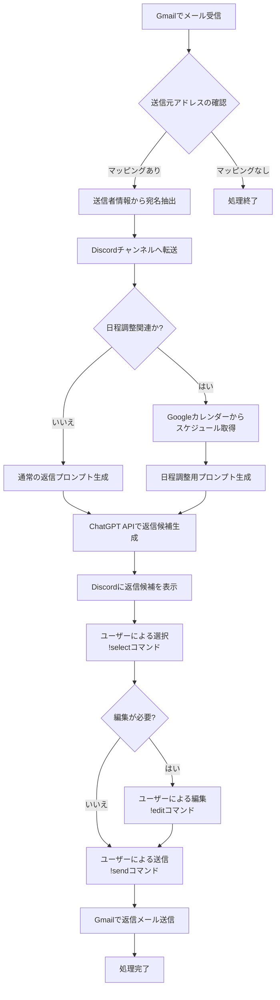

# Gmail-Discord自動転送・返信システム

GmailからDiscordへのメール自動転送と、ChatGPT APIを活用した返信候補生成システム。送信元情報から適切な宛名（〇〇会社 〇〇様）を自動設定し、日程調整メールの場合はGoogleカレンダーと連携した候補日時の提案も行います。

## 目次

1. [機能概要](#機能概要)
2. [システム要件](#システム要件)
3. [インストール手順](#インストール手順)
4. [API設定ガイド](#api設定ガイド)
   - [Gmail API設定](#gmail-api設定)
   - [Discord API設定](#discord-api設定)
   - [OpenAI API設定](#openai-api設定)
   - [Googleカレンダー API設定](#googleカレンダー-api設定)
5. [設定ファイルの作成](#設定ファイルの作成)
   - [環境変数の設定](#環境変数の設定)
   - [メールとチャンネルのマッピング](#メールとチャンネルのマッピング)
6. [実行方法](#実行方法)
7. [使用方法](#使用方法)
   - [Discordコマンド一覧](#discordコマンド一覧)
   - [メール処理フロー](#メール処理フロー)
   - [処理フロー図](#処理フロー図)
8. [プロジェクト構造](#プロジェクト構造)
9. [トラブルシューティング](#トラブルシューティング)
10. [よくある質問（FAQ）](#よくある質問faq)
11. [ライセンス](#ライセンス)

## 機能概要

- **メール自動転送**: Gmailで受信したメールを送信元のメールアドレスごとに対応するDiscordチャンネルへ自動転送
- **宛名自動設定**: 送信元情報から会社名・担当者名を抽出し、「〇〇会社 〇〇様」の形式で自動設定
- **返信候補生成**: ChatGPT APIを活用して複数のビジネスメール形式の返信パターンを生成
- **日程調整機能**: 日程調整に関するメールの場合、GoogleカレンダーAPIと連携し、実際のスケジュール確認を行った上で適切な返信文（候補日時を含む）を自動生成

## システム要件

- Python 3.8以上
- pip（Pythonパッケージマネージャー）
- インターネット接続
- Gmail、Discord、OpenAI、Googleカレンダーの各アカウント

## インストール手順

1. リポジトリをクローンまたはダウンロード

```bash
git clone https://github.com/yourusername/gmail-discord-bot.git
cd gmail-discord-bot
```

2. 仮想環境の作成と有効化

```bash
# 仮想環境の作成
python -m venv venv

# 仮想環境の有効化
# Linuxの場合:
source venv/bin/activate
# Windowsの場合:
venv\Scripts\activate
```

3. 必要なパッケージのインストール

```bash
pip install -r requirements.txt
```

## API設定ガイド

### Gmail API設定

1. [Google Cloud Console](https://console.cloud.google.com/)にアクセスし、新しいプロジェクトを作成
2. 左側のメニューから「APIとサービス」→「ライブラリ」を選択
3. 検索バーで「Gmail API」を検索し、選択して「有効にする」をクリック
4. 「認証情報を作成」をクリックし、「OAuth クライアント ID」を選択
5. 「同意画面を構成」をクリックし、必要な情報を入力
   - ユーザータイプ: 外部
   - アプリ名、ユーザーサポートメール、デベロッパーの連絡先情報を入力
   - スコープの追加画面で「.../auth/gmail.readonly」と「.../auth/gmail.send」を追加
   - テストユーザーにご自身のGmailアドレスを追加
6. 「認証情報」ページに戻り、「認証情報を作成」→「OAuth クライアント ID」を選択
   - アプリケーションの種類: デスクトップアプリ
   - 名前を入力し、「作成」をクリック
7. ダウンロードボタンをクリックして認証情報（credentials.json）をダウンロード
8. ダウンロードしたファイルを`gmail_discord_bot/config/`ディレクトリに配置

### Discord API設定

1. [Discord Developer Portal](https://discord.com/developers/applications)にアクセス
2. 「New Application」をクリックし、アプリケーション名を入力して作成
3. 左側のメニューから「Bot」を選択し、「Add Bot」をクリック
4. 「Reset Token」をクリックしてトークンを表示し、コピー（このトークンは後で`.env`ファイルに設定）
5. 「MESSAGE CONTENT INTENT」を有効化
6. 左側のメニューから「OAuth2」→「URL Generator」を選択
7. 「SCOPES」で「bot」を選択
8. 「BOT PERMISSIONS」で以下の権限を選択:
   - Read Messages/View Channels
   - Send Messages
   - Embed Links
   - Attach Files
   - Read Message History
   - Add Reactions
9. 生成されたURLをコピーしてブラウザで開き、ボットを追加したいDiscordサーバーを選択
10. サーバーのIDをコピー（後で`.env`ファイルに設定）
    - サーバーIDを取得するには、Discordの設定で開発者モードを有効にし、サーバー名を右クリックして「IDをコピー」を選択

### OpenAI API設定

1. [OpenAIのウェブサイト](https://platform.openai.com/)にアクセスし、アカウントを作成またはログイン
2. 右上のプロファイルアイコンをクリックし、「View API keys」を選択
3. 「Create new secret key」をクリックし、新しいAPIキーを生成
4. 生成されたAPIキーをコピー（このキーは後で`.env`ファイルに設定）

### Googleカレンダー API設定

1. [Google Cloud Console](https://console.cloud.google.com/)で、Gmail APIを設定したのと同じプロジェクトを使用
2. 左側のメニューから「APIとサービス」→「ライブラリ」を選択
3. 検索バーで「Google Calendar API」を検索し、選択して「有効にする」をクリック
4. 「認証情報を作成」をクリックし、「OAuth クライアント ID」を選択
5. アプリケーションの種類: デスクトップアプリ
6. 名前を入力し、「作成」をクリック
7. ダウンロードボタンをクリックして認証情報（calendar_credentials.json）をダウンロード
8. ダウンロードしたファイルを`gmail_discord_bot/config/`ディレクトリに配置

## 設定ファイルの作成

### 環境変数の設定

1. `.env.example`ファイルをコピーして`.env`ファイルを作成

```bash
cp gmail_discord_bot/config/.env.example gmail_discord_bot/config/.env
```

2. `.env`ファイルを編集し、必要な情報を設定

```
# Gmail API
GMAIL_CREDENTIALS_FILE=credentials.json
GMAIL_TOKEN_FILE=token.json
GMAIL_SCOPES=https://www.googleapis.com/auth/gmail.readonly,https://www.googleapis.com/auth/gmail.send

# Discord API
DISCORD_BOT_TOKEN=your_discord_bot_token
DISCORD_GUILD_ID=your_discord_guild_id

# OpenAI API
OPENAI_API_KEY=your_openai_api_key

# Google Calendar API
CALENDAR_CREDENTIALS_FILE=calendar_credentials.json
CALENDAR_TOKEN_FILE=calendar_token.json
CALENDAR_SCOPES=https://www.googleapis.com/auth/calendar.readonly

# Database
DATABASE_URL=sqlite:///email_bot.db

# Email Mapping
EMAIL_CHANNEL_MAPPING_FILE=email_channel_mapping.json
```

- `your_discord_bot_token`: Discord Developer Portalで取得したボットトークン
- `your_discord_guild_id`: ボットを追加したDiscordサーバーのID
- `your_openai_api_key`: OpenAIで生成したAPIキー

### メールとチャンネルのマッピング

1. `email_channel_mapping.json`ファイルを`gmail_discord_bot/config/`ディレクトリに作成

```json
{
  "example@company.com": "123456789012345678",
  "another@example.com": "876543210987654321",
  "domain.com": "567890123456789012",
  "*@wildcard.com": "345678901234567890"
}
```

- キー: メールアドレス、ドメイン、またはワイルドカードパターン
- 値: 対応するDiscordチャンネルのID（チャンネルIDを取得するには、Discordの設定で開発者モードを有効にし、チャンネル名を右クリックして「IDをコピー」を選択）

## 実行方法

1. 初回実行時は、Gmail APIとGoogleカレンダーAPIの認証が必要

```bash
python -m gmail_discord_bot.main
```

2. ブラウザが自動的に開き、Googleアカウントへのアクセス許可を求められます
3. アクセスを許可すると、トークンが保存され、以降の実行では認証は不要になります
4. プログラムが正常に起動すると、ログにDiscordボットのログイン情報が表示されます

## 使用方法

### Discordコマンド一覧

- `!help` - ヘルプメッセージを表示
- `!status` - ボットのステータスを表示
- `!select [番号]` - 提案された返信から選択（番号は1から始まる）
- `!edit [番号] [新しい内容]` - 提案された返信を編集
- `!send [番号]` - 選択した返信を実際にメールとして送信

### メール処理フロー

1. 新しいメールが受信されると、設定されたマッピングに基づいて対応するDiscordチャンネルに転送されます
2. ボットが自動的に返信候補を生成し、チャンネルに投稿します
3. ユーザーは`!select`コマンドで返信候補を選択できます
4. 必要に応じて`!edit`コマンドで返信内容を編集できます
5. `!send`コマンドで選択した返信をメールとして送信できます

#### 処理フロー図



## プロジェクト構造

```
gmail_discord_bot/
├── __init__.py
├── main.py                      # アプリケーションのエントリーポイント
├── gmail_module/                # Gmailとの連携を担当
│   ├── __init__.py
│   ├── gmail_client.py          # Gmail APIクライアント
│   └── email_processor.py       # メール処理ロジック
├── discord_module/              # Discordとの連携を担当
│   ├── __init__.py
│   ├── discord_bot.py           # Discordボットの実装
│   └── message_formatter.py     # メッセージフォーマット処理
├── name_module/                 # 宛名管理を担当
│   ├── __init__.py
│   ├── name_extractor.py        # メールから宛名情報を抽出
│   └── name_manager.py          # 宛名情報の管理
├── chatgpt_module/              # ChatGPT連携を担当
│   ├── __init__.py
│   ├── prompt_generator.py      # プロンプト生成
│   └── response_processor.py    # 応答処理
├── calendar_module/             # Googleカレンダー連携を担当
│   ├── __init__.py
│   ├── calendar_client.py       # カレンダーAPIクライアント
│   └── schedule_analyzer.py     # スケジュール分析
├── database/                    # データベース関連
│   ├── __init__.py
│   ├── models.py                # データモデル
│   └── db_manager.py            # DB操作
├── utils/                       # ユーティリティ関数
│   ├── __init__.py
│   ├── logger.py                # ロギング
│   └── error_handler.py         # エラーハンドリング
├── config/                      # 設定関連
│   ├── config.py                # 設定管理
│   ├── .env.example             # 環境変数サンプル
│   └── .env                     # 環境変数（作成必要）
└── tests/                       # テスト
    ├── __init__.py
    ├── test_gmail.py
    ├── test_discord.py
    ├── test_name.py
    ├── test_chatgpt.py
    ├── test_calendar.py
    └── test_integration.py
```

## トラブルシューティング

### API認証エラー

**問題**: API認証に関するエラーが発生する

**解決策**:
1. 認証情報ファイル（credentials.json, calendar_credentials.json）が正しい場所にあるか確認
2. トークンファイル（token.json, calendar_token.json）を削除して再認証を試みる
3. APIキーやトークンが正しく`.env`ファイルに設定されているか確認
4. Google Cloud ConsoleでAPIが有効になっているか確認

### メールが転送されない

**問題**: 新しいメールが受信されてもDiscordに転送されない

**解決策**:
1. `email_channel_mapping.json`ファイルのマッピングが正しいか確認
2. ログファイルでエラーメッセージを確認
3. Gmail APIのスコープが正しく設定されているか確認
4. Discordボットがサーバーに正しく招待され、チャンネルにアクセスできるか確認

### 返信候補が生成されない

**問題**: メールは転送されるが、返信候補が生成されない

**解決策**:
1. OpenAI APIキーが正しく設定されているか確認
2. OpenAI APIの使用制限に達していないか確認
3. ログファイルでエラーメッセージを確認
4. インターネット接続を確認

### Discordボットが応答しない

**問題**: Discordボットがコマンドに応答しない

**解決策**:
1. ボットが正しく起動しているか確認（ログで「〇〇としてログインしました」メッセージを確認）
2. ボットトークンが正しく設定されているか確認
3. ボットに必要な権限が付与されているか確認
4. Discordの接続状態を確認

## よくある質問（FAQ）

### Q: 返信候補はどのように選択・送信されますか？

A: Discord上に生成された複数の返信パターンが表示され、ユーザーが`!select [番号]`コマンドで適切なものを選択します。必要に応じて`!edit [番号] [新しい内容]`コマンドで編集した上で、`!send [番号]`コマンドで実際の返信メールとして送信します。

### Q: メール内容の解析はどのように行われますか？

A: メール内容のキーワード解析により、日程調整の意図が含まれるかを判断します。「面談希望」「日程調整」「打ち合わせ」などのキーワードがあれば日程調整返信として処理します。同時に送信者情報も解析し適切な宛名を設定します。

### Q: システムのダウンタイムが発生した場合はどうなりますか？

A: 未処理のメールがある場合は、システム復旧後に処理キューから順次処理します。重要なメールが見逃されないよう、エラーログと未処理メール一覧を管理者に通知する仕組みがあります。

### Q: APIの使用制限にはどう対応しますか？

A: 各APIの使用制限を監視し、制限に近づいた場合はレート制限を設けています。特にChatGPT APIやGmail APIの利用量が多い場合は、処理の優先順位付けや一時的な機能制限などの対策が必要です。

### Q: 宛名情報の学習はどのように行われますか？

A: 一度やり取りしたメールアドレスと対応する会社名・担当者名をデータベースに保存します。メール署名の解析や返信時に手動で修正された宛名情報も学習し、次回からの精度向上に活用します。

### Q: 宛名情報の更新はどうしますか？

A: 同じメールアドレスでも担当者が変わる場合があるため、最新のメールに含まれる署名情報を優先的に使用します。また、管理画面からいつでも手動で情報を更新できる仕組みも用意しています。

## ライセンス

MIT
